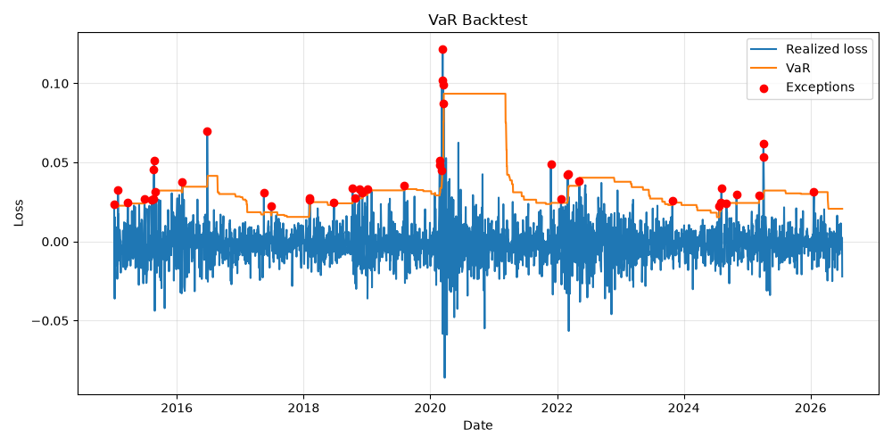
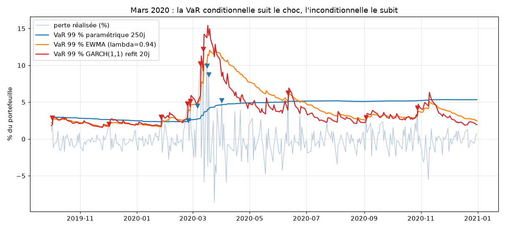
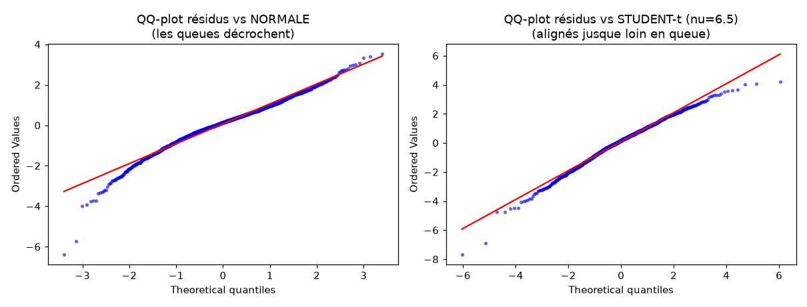
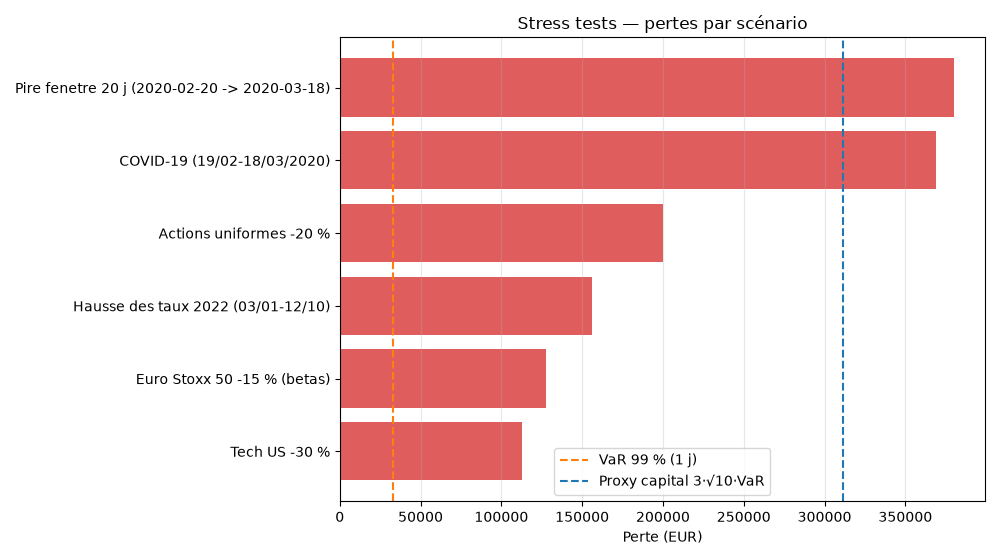
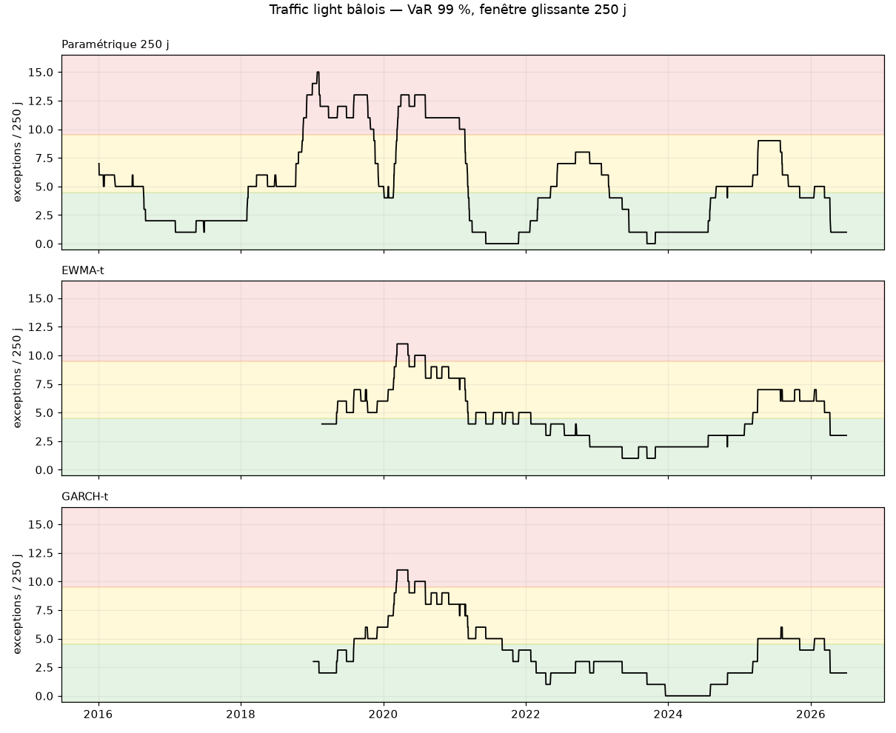
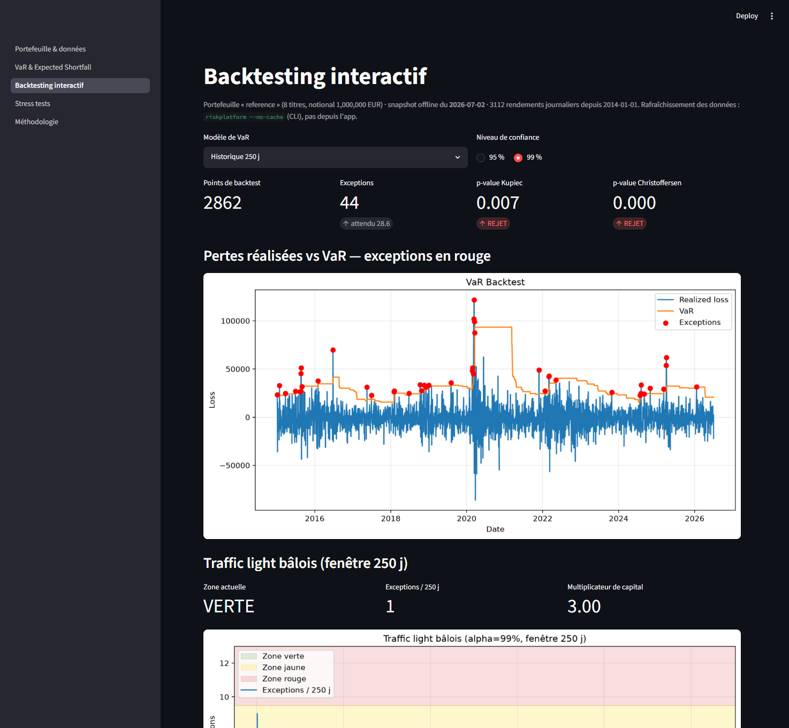
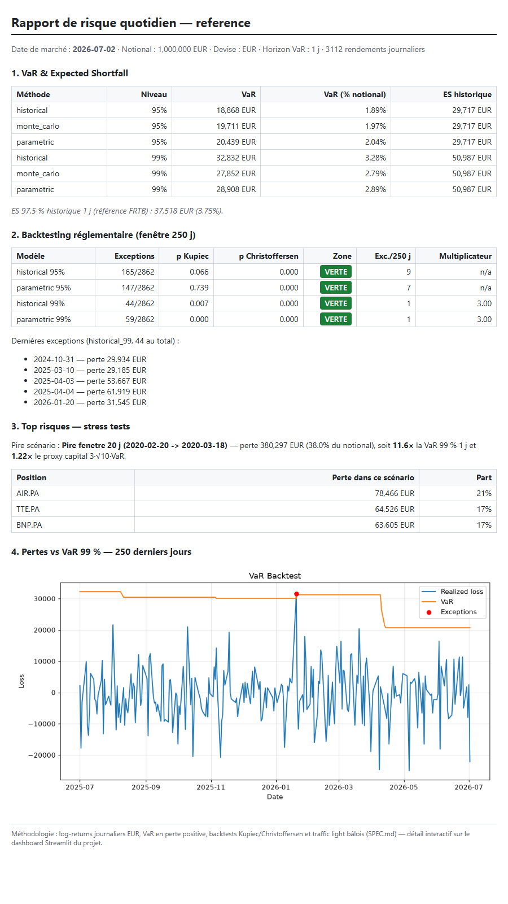

# risk-platform — mesure des risques de marché


Une plateforme de mesure des risques de marché construite brique par brique à
partir d'un moteur de Value-at-Risk. L'état actuel (briques 0–4) : VaR par
trois méthodes, **volatilité conditionnelle EWMA et GARCH(1,1) écrits à la
main** (MLE compris), **Monte Carlo Student-t multivarié** (dépendance de
queue), **Expected Shortfall** (historique, formules fermées normale et
Student-t, Monte Carlo) avec son backtest d'Acerbi-Székely, backtesting
Kupiec/Christoffersen, lecture réglementaire FRTB, **stress testing**
(scénarios historiques rejoués, chocs hypothétiques de prix et de
paramètres), **traffic light bâlois** reliant le backtest au multiplicateur
de capital, un **dashboard Streamlit** de cinq pages et un **rapport de
risque quotidien** HTML type middle office — le tout packagé, configurable en
YAML et vérifié par une CI qui rejoue tous les résultats publiés (dashboard
compris) sur un snapshot de données committé.

L'objectif n'est pas d'empiler des formules : chaque mesure produite est
**confrontée à sa propre fiabilité** par backtesting — y compris quand le
verdict est sévère. Sur 2014–2026, il l'est (voir Résultats).

## Le portefeuille

Défini dans [config/portfolio.yaml](config/portfolio.yaml) : huit valeurs
liquides équipondérées, volontairement mixtes.

| Place | Valeurs |
|---|---|
| Euronext (EUR) | TotalEnergies, LVMH, Sanofi, BNP Paribas, Airbus |
| Nasdaq (USD) | Apple, Microsoft, NVIDIA |

Le mélange EUR/USD n'est pas cosmétique : les titres américains introduisent
un **risque de change** réel pour un investisseur en euros. Les prix USD sont
convertis en EUR *avant* le calcul des rendements, si bien que le risque de
change entre directement dans la matrice de covariance au lieu d'être traité à
part. La config référence aussi l'**Euro Stoxx 50 (^STOXX50E) comme benchmark
hors portefeuille** — hors poids car un indice n'est pas investissable et son
cours n'intègre pas les dividendes ; il sert au stress testing (scénario
indiciel propagé par bêtas, brique 3) et aux comparaisons.

## Les trois méthodes

- **Historique** — quantile empirique des rendements passés, aucune hypothèse
  de loi. Capture les queues épaisses telles qu'elles se sont produites, mais
  reste entièrement tournée vers le passé.
- **Paramétrique (variance-covariance)** — suppose des rendements gaussiens,
  `VaR = |z| · √(wᵀΣw)`. Rapide, analytique, met en valeur la diversification
  via la covariance, mais sous-estime structurellement le risque extrême.
- **Monte Carlo** — simule les rendements par une multinormale (Cholesky) puis
  prend le quantile empirique des pertes simulées. Sous loi normale, il
  converge vers la paramétrique ; sa valeur ajoutée viendra du changement de
  loi (Student-t, brique 2).

S'y ajoutent l'**Expected Shortfall** (perte moyenne au-delà de la VaR, mesure
cohérente vers laquelle Bâle/FRTB a basculé) et la mise à l'échelle temporelle
en racine du temps.

## Le backtesting

Estimer la VaR sur fenêtre glissante (250 jours), la confronter aux pertes du
lendemain, compter les **exceptions**, puis tester :

- **Kupiec (POF)** — le nombre d'exceptions est-il conforme au taux attendu
  (couverture non conditionnelle) ?
- **Christoffersen** — les exceptions sont-elles regroupées dans le temps ?
  Des grappes trahissent un modèle trop lent à réagir aux changements de
  volatilité. Combiné à Kupiec : test de couverture conditionnelle (CC).

## Résultats (2014 → mi-2026, VaR 1 jour)

3 112 rendements quotidiens, 2 862 points de backtest — un échantillon qui
contient **deux crises** : le COVID (mars 2020) et la hausse des taux de 2022.

| Niveau | Méthode | VaR 1j | Exceptions (sur 2862) | Kupiec | CC (Christoffersen) |
|---|---|---|---|---|---|
| 95 % | Historique | 0.0189 | 165 (~143 attendues) | OK | **REJET** |
| 95 % | Paramétrique | 0.0204 | 147 | OK | **REJET** |
| 99 % | Historique | 0.0328 | 44 (~29 attendues) | **REJET** | **REJET** |
| 99 % | Paramétrique | 0.0289 | 59 | **REJET** | **REJET** |

Trois lectures.

**À 99 %, la paramétrique reste la pire** (59 exceptions pour ~29 attendues,
p-value Kupiec ≈ 6·10⁻⁷) : sous-estimation gaussienne des queues, comme sur la
période courte archivée.

**Mais sur 12,5 ans, même la VaR historique 99 % échoue à Kupiec** (44
exceptions). Avec deux crises dans l'échantillon, une fenêtre de 250 jours
calibrée sur une année calme arrive systématiquement trop basse dans la crise
suivante.

**Christoffersen rejette tout, partout.** Les exceptions arrivent en grappes
(mars 2020, 2022) : une VaR à volatilité constante sur fenêtre glissante ne
réagit pas assez vite aux changements de régime. C'est précisément ce que la
**brique 1 (volatilité conditionnelle EWMA/GARCH)** doit corriger — le
résultat phare attendu du projet.



> Les résultats de la version précédente (2018–2024, où l'historique passait
> encore) sont archivés avec l'explication de l'écart dans
> [docs/archive/var-engine-2018-2024.md](docs/archive/var-engine-2018-2024.md).

## Le résultat phare — mars 2020, ou réparer la dynamique de la VaR

Le rejet généralisé de Christoffersen ci-dessus a une cause précise : une VaR
à fenêtre glissante suppose la volatilité constante sur 250 jours. La brique 1
remplace σ par **σ_t conditionnel** — EWMA (RiskMetrics, λ = 0,94) et
GARCH(1,1) estimé par maximum de vraisemblance **implémenté à la main** (la
lib `arch` ne sert que d'oracle dans les tests). Backtest VaR 99 % sur
2019–2021 (751 jours, dont le krach COVID) :

| Modèle | Exceptions (7,5 attendues) | Kupiec (couverture) | Christoffersen (indépendance) |
|---|---|---|---|
| Paramétrique 250 j | 17, dont **9 entre le 24/02 et le 01/04/2020** | **REJET** (p = 0,003) | **REJET** (p = 0,005) |
| Historique 250 j | 10 | ok | ok (10 exceptions : puissance faible) |
| **EWMA λ=0,94** | 21, étalées sur 3 ans | **REJET** (p < 10⁻⁴) | **ok (p = 0,61)** |
| **GARCH(1,1) refit 20 j** | 21, étalées sur 3 ans | **REJET** (p < 10⁻⁴) | **ok (p = 0,61)** |
| **EWMA Student-t** (brique 2) | 19 | **REJET** (p = 4·10⁻⁴) | ok (p = 0,50) |
| **GARCH Student-t** (brique 2) | 18 | **REJET** (p = 10⁻³) | ok (p = 0,45) |

*Sur la ligne « Historique 250 j » : son double ok n'est pas une victoire du
modèle. Avec 10 exceptions, le test d'indépendance a peu de puissance ; sa
survie en 2020 tient à ce que sa queue empirique contenait déjà des jours
violents (VaR plus haute que la gaussienne AVANT le choc) ; et sur
l'échantillon complet 2014–2026 (tableau précédent), elle est rejetée par
Kupiec. Structurellement, elle reste aussi lente que la paramétrique — aucun
quantile empirique ne la rendra réactive.*



Deux enseignements, à lire ensemble :

**La volatilité conditionnelle répare la dynamique.** Pendant la crise, la
paramétrique 250 j reste quasi plate autour de 4 % et se fait percer 9 fois en
six semaines ; l'EWMA et le GARCH encaissent les 4 premiers jours du choc puis
montent à 12–15 % — plus aucune exception du reste de la crise, et une décrue
rapide dès avril là où la fenêtre glissante reste gonflée des mois (effet
« fantôme »). Le test d'indépendance passe de p = 0,005 à p = 0,61.

**Elle ne répare pas le niveau.** 21 exceptions au lieu de 7,5 : même
conditionnées, les innovations restent gaussiennes alors que les résidus
standardisés r_t/σ_t sont leptokurtiques — le quantile 2,33·σ_t est
structurellement trop court à 99 %.

**Le quantile Student-t (brique 2) réduit l'écart de moitié — et ne suffit
toujours pas à 99 % en crise.** Le degré de liberté estimé par MLE sur les
résidus est **ν ≈ 6,5** (sensibilité : à ν±2, la VaR 99 % ne bouge que de
∓2 à 3 % — le choix exact de ν n'est pas ce qui fait le modèle). La VaR monte
de ~10 %, les exceptions passent de 21 à 19 (EWMA) et 18 (GARCH) sur l'étude,
et de **48 à 37 sur l'échantillon complet** (p-value Kupiec multipliée par
1 000) — mais le rejet demeure. Les exceptions restantes sont des **sauts
« jour 1 »** depuis un régime calme (σ_t a un jour de retard par
construction), et le MLE de ν calibre toute la densité, pas la queue à 1 %
(le domaine de l'EVT, hors périmètre). À 95 %, tout passe. Diagnostic complet
dans les deux notebooks
([brique 1](notebooks/etude_2020_var_conditionnelle.ipynb),
[brique 2](notebooks/etude_student_t_es.ipynb)) ; chaque verdict de ce tableau
est verrouillé par un test CI
([tests/test_etude_2020.py](tests/test_etude_2020.py)) rejouant le snapshot
de données committé ([data/cache/](data/cache/)).



## L'angle FRTB : VaR 99 % vs Expected Shortfall 97,5 %

Bâle (FRTB) a remplacé la VaR 99 % par l'**ES 97,5 %** : l'ES est
**sous-additif** (mesure cohérente au sens Artzner — la diversification ne
peut pas augmenter le risque affiché, ce que la VaR ne garantit pas) et
intègre la **sévérité** des pertes au-delà du seuil, pas seulement leur
fréquence. Sur le portefeuille (2014–2026, formules fermées implémentées et
validées contre intégration numérique) :

| Loi | VaR 99 % | ES 97,5 % | ES/VaR |
|---|---|---|---|
| Normale | 0.0289 | 0.0290 | **1.001** |
| Student-t inconditionnelle (ν = 3,8) | 0.0330 | 0.0354 | 1.07 |
| Historique | 0.0328 | 0.0375 | 1.14 |

*Deux ν cohabitent dans ce README, et ce n'est pas une coquille : ici
**ν = 3,8**, estimé sur les rendements **bruts** ; plus haut **ν ≈ 6,5**,
estimé sur les **résidus** r_t/σ_t. C'est attendu — une grosse partie de la
kurtosis des rendements bruts vient du mélange de régimes de volatilité
(alternance calme/crise), pas des innovations : une fois σ_t filtré par le
GARCH, les résidus se rapprochent de la gaussienne et ν remonte. Autrement
dit, le GARCH « explique » une partie des queues épaisses ; la t n'a plus à
porter que le reste.*

La première ligne est le **calibrage bâlois rendu visible** : sous loi
normale, ES 97,5 % = VaR 99 % à 0,1 % près (transition volontairement neutre,
vérifiée par un test). Sous queues épaisses, l'ES décolle de 7 à 14 % : un
portefeuille gaussien ne « voit » pas la migration réglementaire, un
portefeuille réel, si. Le backtest d'ES (**Z₂ d'Acerbi-Székely**, p-value par
simulation sous H0) complète le tableau avec un verdict honnête : sur la
fenêtre de crise, même l'ES conditionnel Student-t sous-estime la queue
réalisée (z = +0,90 contre +1,11 en normal — moins mauvais, mais rejeté). La
sévérité extrême relève du stress testing — section suivante.

## Le stress testing — chiffrer ce que la VaR ne voit pas (brique 3)

La VaR répond « quel quantile à 1 % » ; le stress testing répond « **combien
je perds SI** ce scénario se réalise », sans probabilité attachée. Suite de
scénarios sur le portefeuille courant (1 M€), chocs en rendements
arithmétiques exacts (`exp(Σr) − 1` pour les replays — l'approximation log
fausserait de plusieurs points à −38 %), pertes rapportées à la VaR 99 % 1 j
(32,8 k€) et à un **proxy de capital IMA `3·√10·VaR`** (311 k€, multiplicateur
plancher × horizon 10 j) :

| Scénario | Perte | % notional | × VaR 99 % | × proxy capital |
|---|---|---|---|---|
| **Pire fenêtre 20 j (extraite : 20/02 → 18/03/2020)** | **380 k€** | 38,0 % | 11,6 | **1,22** |
| COVID-19 rejoué (19/02 → 18/03/2020) | 369 k€ | 36,9 % | 11,2 | **1,19** |
| Actions uniformes −20 % | 200 k€ | 20,0 % | 6,1 | 0,64 |
| Hausse des taux 2022 rejouée (03/01 → 12/10) | 156 k€ | 15,6 % | 4,8 | 0,50 |
| Euro Stoxx 50 −15 % (propagé par bêtas) | 128 k€ | 12,8 % | 3,9 | 0,41 |
| Tech US −30 % (AAPL, MSFT, NVDA) | 113 k€ | 11,3 % | 3,4 | 0,36 |



S'y ajoutent les **chocs de paramètres**, qui ne bougent aucun prix mais
déforment la distribution (sortie = VaR stressée) : corrélations → 1 par
mélange convexe `(1−s)·R + s·J` (la matrice reste PSD pour tout s) multiplie
la VaR par **1,57** — la diversification vaut ~36 % de la VaR de ce
portefeuille ; volatilités ×2 la double exactement (homogénéité) ; le combiné
« crise systémique » (σ×2, ρ→1) fait ×3,14.

Quatre lectures :

- **Un scénario réellement advenu dépasse le proxy de capital** (COVID :
  1,19×) : le quantile à 1 % ne dit rien de la taille de ce qui arrive
  au-delà, et la règle √10 suppose une diffusion sans sauts. C'est l'argument
  d'existence du stress testing réglementaire.
- **La pire fenêtre 20 j est extraite des données, pas décrétée** : elle
  tombe sur le 20/02 → 18/03/2020, à un jour près la fenêtre COVID datée dans
  la spec — l'extraction prouve le choix des dates.
- **La table par position raconte la nature du choc** : en 2022,
  TotalEnergies finit *positif* (+22,5 k€, choc énergétique) pendant que
  NVDA perd 68 k€ — rotation sectorielle ; en mars 2020, les huit lignes
  perdent ensemble — choc systémique.
- **Limite assumée du scénario indiciel** : les bêtas sont estimés en OLS
  pleine période ; en crise ils montent avec les corrélations, la propagation
  est donc sous-estimée (bêtas conditionnels hors périmètre) — c'est le choc
  de corrélations → 1 qui borne cet effet.

## Le traffic light bâlois — du backtest au capital (brique 3)

Le dispositif de Bâle (1996) transforme le comptage d'exceptions en coût en
capital : sur les 250 derniers jours, la VaR 99 % est classée **verte (0–4
exceptions), jaune (5–9, plus-factor de 0,40 à 0,85) ou rouge (≥ 10,
plus-factor 1,00)**, et le multiplicateur de capital vaut 3 + plus-factor.
Les bornes ne sont pas codées en dur : elles sont **dérivées de la CDF
binomiale** `B(250, 1 %)` aux seuils 95 % / 99,99 % — le test CI vérifie
qu'on retrouve la table de Bâle.



Appliqué en glissant à trois modèles du projet (2015 → 2026) :

- **La paramétrique 250 j passe au rouge dès novembre 2018** (la volatilité
  du T4 2018, avant même le COVID — pic à **15 exceptions/250 j**) et n'en
  sort qu'en **février 2021** : ~483 jours ouvrés en zone rouge,
  multiplicateur plein 4,0, soit **+33 % de capital pendant plus de deux
  ans** — et en pratique un modèle interne retoqué par le superviseur.
- **EWMA-t et GARCH-t touchent aussi le rouge** — 81 jours, mars → août 2020
  (pic à 11) : ce sont les sauts « jour 1 » diagnostiqués à la brique 2,
  qu'aucun filtre à retard 1 n'évite. La différence est la **vitesse de
  sortie** : la VaR conditionnelle remonte avec σ_t, les exceptions cessent,
  le modèle ressort du rouge en 5 mois (contre 27).
- Sur l'ensemble des dates, GARCH-t est vert 62 % du temps, EWMA-t 53 %, la
  paramétrique 45 % (et rouge 18,5 %). **En fin d'échantillon, les trois
  modèles sont verts, multiplicateur plancher 3,0.**

Étude complète : [notebooks/etude_stress_traffic_light.ipynb](notebooks/etude_stress_traffic_light.ipynb) ;
chaque verdict ci-dessus est verrouillé par
[tests/test_etude_stress.py](tests/test_etude_stress.py) sur le snapshot
committé. La CLI intègre les deux : `riskplatform` écrit la table de stress
(`outputs/stress_tests.*`) et la ligne traffic light de chaque backtest.

## Le dashboard & le rapport quotidien (brique 4)

**➜ Dashboard en ligne : [risk-platform.streamlit.app](https://risk-platform.streamlit.app/)**

Tout ce qui précède est consultable sans lire une ligne de code. Un
refactoring préalable a extrait le calcul de la CLI dans
**`pipeline.run_analysis()`**, la **source de calcul unique** qui renvoie un
objet `RiskAnalysis` gelé — la CLI, le dashboard et le rapport quotidien
consomment le même objet, aucun chiffre n'est calculé deux fois ni
différemment selon la surface.

**Le dashboard** (`streamlit run app/streamlit_app.py`) — cinq pages sur le
snapshot committé (offline, reproductible ; la date des données est affichée
en tête de chaque page) : portefeuille & données, VaR/ES par méthode,
**backtesting interactif** (les 4 modèles du récit — historique,
paramétrique, EWMA-t, GARCH-t — avec p-values et traffic light rolling),
stress tests, et une page méthodologie qui raconte le projet en cinq actes
(rien ne tient → le timing est réparé → le niveau à moitié → risque de saut
→ stress testing), formules en second niveau.



**Le rapport de risque quotidien** (`outputs/daily_report.html`, généré par
la CLI) — une page HTML **autonome** (CSS inline, figure embarquée en
base64 : envoyable par mail, imprimable en PDF) : VaR/ES du jour en EUR,
référence FRTB 97,5 %, zone traffic light et multiplicateur, cinq dernières
exceptions datées, top risques stress et pertes vs VaR sur 250 jours.



Le dashboard est testé **en CI** par `streamlit.testing.v1.AppTest`
(headless, sans réseau) : chaque page doit s'exécuter sans exception sur le
snapshot, et deux interactions clés sont verrouillées (changer le niveau de
confiance déplace la VaR, changer de modèle change la série de backtest).

## Structure du projet

```
src/riskplatform/
  data/             prix (yfinance + cache CSV), conversion FX EUR, log-returns
  portfolio.py      poids, agrégation, matrice de covariance
  volatility/       ewma.py (RiskMetrics), garch.py (MLE maison)
  distributions.py  Student-t standardisée : quantile, MLE du degré de liberté
  var/              historical, parametric, monte_carlo (normal + t), conditional
  es.py             ES historique, fermé normal/Student-t, MC, conditionnel
  stress/           scénarios (replay, chocs prix/indice/paramètres) + moteur
  backtest/         exceptions, kupiec, christoffersen, es_backtest (AS Z2),
                    traffic_light (zones bâloises dérivées de la binomiale)
  reporting/        tableaux, graphiques, rapport de stress, rapport quotidien HTML
  pipeline.py       run_analysis() -> RiskAnalysis : la source de calcul unique
  config.py         chargement/validation du YAML de portefeuille
  cli.py            résumé console + rendu outputs/ (riskplatform / python -m riskplatform)
app/                    dashboard Streamlit (routeur + 5 vues, extra [app])
config/portfolio.yaml   portefeuille de référence (source de vérité)
data/cache/             snapshot de marché figé (résultats rejouables offline)
notebooks/              3 études exécutées (2020 conditionnel ; Student-t & ES ;
                        stress & traffic light)
tests/                  260 tests, sans réseau (snapshot + yfinance mocké + AppTest)
```

Chaque module est testé isolément, sans appel réseau. Les modules de calcul
(`var/`, `backtest/`) sont aussi vérifiés par tests de mutation : casser
volontairement une formule (signe d'un quantile, orientation de Cholesky,
degrés de liberté d'un test) doit faire échouer au moins un test.

## Limites actuelles

- **La queue à 1 % reste plus lourde que la t calibrée par MLE global** :
  couvrir les exceptions restantes exigerait ν ≈ 3, que le centre gaussien des
  résidus interdit au MLE. L'approche « queue seule » (EVT/POT, simulation
  historique filtrée) est la suite naturelle, hors périmètre.
- **Risque de saut irréductible pour un filtre à retard 1** : σ²_t utilise
  r_{t-1}, aucun quantile ne couvre un gap de −4 % parti d'un σ_t de 1 % — le
  stress testing (brique 3) le chiffre, il ne le prédit pas.
- **Vol conditionnelle univariée** (sur le rendement de portefeuille agrégé) :
  σ_t capte le régime, pas la déformation des corrélations en crise — bornée
  par le choc corrélations → 1 du stress testing, pas modélisée (DCC hors
  périmètre).
- **Bêtas du scénario indiciel estimés pleine période** : ils sous-estiment
  la propagation en crise (bêtas conditionnels hors périmètre).
- **Portefeuille linéaire uniquement** (pas d'options).

## Lancer le projet

```bash
pip install -e ".[dev]"
riskplatform                       # ou : python -m riskplatform
riskplatform --config autre.yaml --start 2020-01-01 --alphas 0.99
streamlit run app/streamlit_app.py # dashboard (extra [app], inclus dans [dev])
```

Le portefeuille, la période (2014 → aujourd'hui) et les niveaux de confiance
vivent dans `config/portfolio.yaml` ; les flags CLI priment. Les données de
marché passent par un cache CSV write-through (`data/cache/`, snapshot daté
committé — `--no-cache` pour forcer un téléchargement frais). Le Monte Carlo
est initialisé avec une graine fixe pour des résultats reproductibles. Les
tableaux, graphiques et le rapport quotidien (`daily_report.html`) sont
écrits dans `outputs/`.

```bash
python -m pytest                   # suite de tests (offline, dashboard inclus)
ruff check src tests app           # lint (celui de la CI)
```

**Déploiement Streamlit Community Cloud** : l'app est en ligne sur
[risk-platform.streamlit.app](https://risk-platform.streamlit.app/). Le repo
contient un `requirements.txt` d'une ligne (`.[app]`) réservé au déploiement
(branche `main`, main file `app/streamlit_app.py`). L'app tourne sur le
snapshot committé, sans accès réseau au démarrage.
