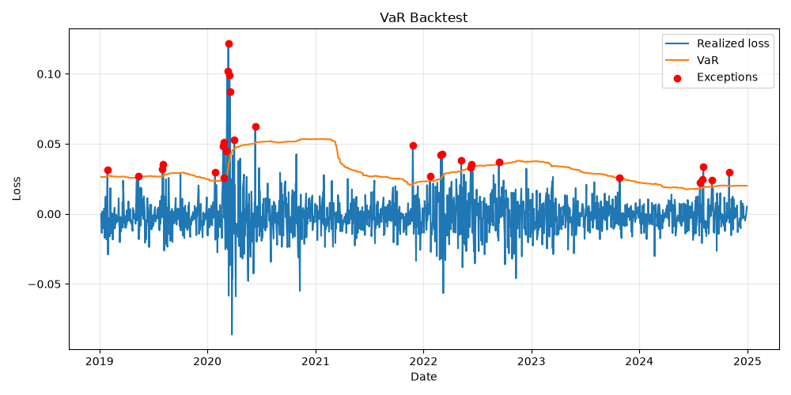

# Archive — résultats du socle var-engine (période 2018–2024, 8 titres)

> Résultats de référence du socle var-engine **avant** le passage à la config
> risk-platform (période 2014→aujourd'hui, benchmark ^STOXX50E hors poids),
> archivés en fin de brique 0 (2026-07-06). Conservés pour pouvoir **expliquer
> l'écart entre les deux versions**.

## Paramètres du run archivé

- Période : **2018-01-01 → 2024-12-31** (~1 743 séances, 1 493 points de backtest
  après la fenêtre de 250 jours).
- Portefeuille : 8 titres équipondérés (TTE.PA, MC.PA, SAN.PA, BNP.PA, AIR.PA,
  AAPL, MSFT, NVDA), notional 1, pas de benchmark.
- VaR 1 jour, fenêtre glissante 250 jours, Monte Carlo 50 000 tirages seed 42.
- Code : structure plate `src/` (avant migration `src/riskplatform/`) — la
  logique de calcul est **identique** à celle migrée en brique 0.

## VaR / ES (fraction du notional, 1 jour)

| method      | alpha | var      | es (hist.) |
|-------------|-------|----------|------------|
| historical  | 0.95  | 0.020621 | 0.032612   |
| historical  | 0.99  | 0.036473 | 0.057844   |
| monte_carlo | 0.95  | 0.021472 | 0.032612   |
| monte_carlo | 0.99  | 0.030459 | 0.057844   |
| parametric  | 0.95  | 0.022305 | 0.032612   |
| parametric  | 0.99  | 0.031546 | 0.057844   |

## Backtesting (fenêtre 250 j, 1 493 observations)

| name          | exceptions | attendues | Kupiec LR | p-value  | Kupiec | CC LR   | CC p-value | CC     |
|---------------|-----------:|----------:|----------:|---------:|--------|--------:|-----------:|--------|
| historical_95 | 77         | 74.65     | 0.0771    | 0.7813   | OK     | 3.6845  | 0.1585     | OK     |
| parametric_95 | 68         | 74.65     | 0.6419    | 0.4230   | OK     | 4.7369  | 0.0936     | OK     |
| historical_99 | 19         | 14.93     | 1.0317    | 0.3098   | OK     | 2.4161  | 0.2988     | OK     |
| parametric_99 | **29**     | 14.93     | **10.5019** | **0.0012** | **REJET** | **20.1802** | **0.00004** | **REJET** |

## Le résultat phare de cette version

À 99 %, la VaR paramétrique gaussienne (0.0315) est plus basse que l'historique
(0.0365) : la loi normale sous-estime les queues. Conséquence : 29 exceptions
pour ~15 attendues → **rejet Kupiec ET Christoffersen**, avec un clustering
d'exceptions concentré sur mars 2020 (COVID). À 95 %, tout passe — la faille
n'apparaît que dans les queues extrêmes.

## Pourquoi les chiffres régénérés diffèrent (à savoir expliquer)

1. **Période élargie 2014→aujourd'hui** : l'échantillon inclut 2014–2017
   (volatilité modérée) et 2025–2026 ; les quantiles empiriques, Σ et le
   nombre de points de backtest changent mécaniquement.
2. **Plus d'exceptions potentielles** : le backtest couvre désormais aussi la
   hausse des taux 2022 sur une fenêtre 250 j calibrée sur 2021.
3. **Ce qui ne change PAS** : les formules (aucune logique modifiée en brique
   0 — vérifiable par `git diff` du refactoring), le portefeuille 8 titres,
   la fenêtre 250 j, le seed MC. Le benchmark ^STOXX50E est hors poids et
   n'affecte aucun chiffre.
